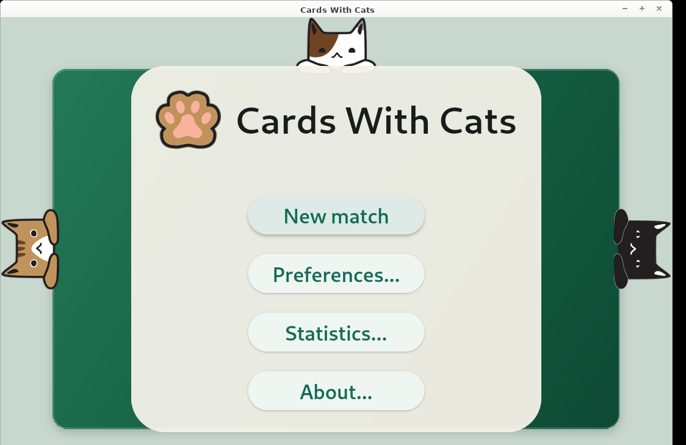
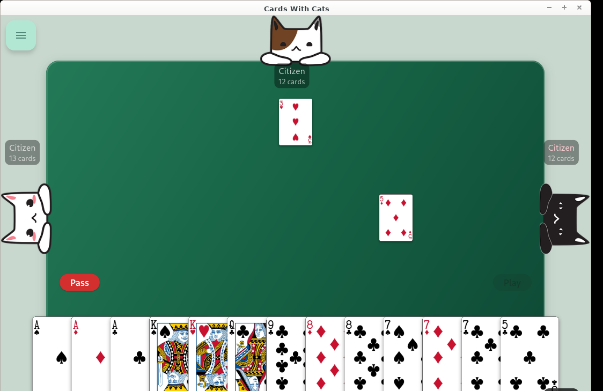

# Cards With Cats

Four classic card games, one table, and three surprisingly strategic cats.
Play **Hearts**, **Spades**, **Oh Hell**, or **Scum** on Android and Linux.





## Game modes

- **Hearts** — avoid point cards, or risk shooting the moon.
- **Spades** — bid with a partner, manage bags, and make your contract.
- **Oh Hell** — predict your tricks as the hand size and trump suit change.
- **Scum** — shed singles or matching sets, climb the table ranks, and trade
  cards between rounds.

Matches are saved automatically. Optional rule variants, card highlighting,
sound controls, and statistics are available from the menu. The interface is
responsive from phone screens to desktop Flatpak windows.

## Install

Download the latest files from the
[Cards With Cats releases](https://github.com/crhy/CardsWithCats/releases).

### Linux

```sh
flatpak install --user ./CardsWithCats.flatpak
flatpak run io.github.crhy.CardsWithCats
```

The Linux build is also available through Spaced Bazaar.

### Android

Install `app-std-release.apk` from the release. Android may ask you to allow
installs from the browser or file manager you used to open it.

## Build from source

[Flutter](https://flutter.dev) is required. Run tests with:

```sh
flutter test
```

On Linux, the included script builds against the Freedesktop 25.08 SDK and
produces `build/CardsWithCats.flatpak`:

```sh
./scripts/build-flatpak.sh
```

Set `FLUTTER_SDK` if Flutter is not installed at `~/development/flutter`.
See [CHANGELOG.md](CHANGELOG.md) for release history.

## Credits

Cards With Cats is based on the original project by
[Brian Nenninger](https://github.com/dozingcatsoftware/CardsWithCats).

- Cats by [AnnaliseArt](https://pixabay.com/illustrations/cats-hanging-cats-kitty-cat-paw-3611310/)
- Cat emojis from [Noto Emoji](https://github.com/googlefonts/noto-emoji/)
- Thought bubble by [OpenClipart-Vectors](https://pixabay.com/vectors/balloon-bubble-speech-thought-150981/)
- Playing cards by Chris Aguilar, licensed under the LGPL 3.0, from
  [Total Nonsense](https://totalnonsense.com/open-source-vector-playing-cards/)

Scum rules were adapted from Bruce Gourley's party rules. The project is
licensed under the BSD 3-Clause License.
